# FINAL PROJECT REPORT - Simple LMS Extended Backend

## Identitas
- **Nama**: Najwah Kamila
- **NIM**: A11.2023.15209
- **Kelas**: A11.4602
- **URL Repository**: https://github.com/kmilawn/PSS-Simple-LMS

## Deskripsi Project
Simple LMS (Learning Management System) adalah backend REST API untuk sistem manajemen pembelajaran yang dibangun dengan Django, Django Ninja, PostgreSQL, dan Docker. Project ini mendukung tiga role: Admin, Instructor, dan Student.

## Fitur Dasar yang Sudah Berjalan (30 Poin)
- Docker Compose dengan service web, db, redis, mongodb, rabbitmq, celery, flower
- Database PostgreSQL berjalan dengan migration lengkap
- JWT Authentication (access + refresh token)
- Role-based access control (admin, instructor, student)
- Endpoint: courses, lessons, enrollments, progress
- README lengkap dengan cara menjalankan
- Swagger/OpenAPI documentation di `/dokumentasi/uas`
- Environment variables via `.env` file

## Fitur Tambahan yang Dipilih (75 Poin)

## 1. Optimasi Query dan N+1 Fixing (15 poin)

**Implementasi:**

Menggunakan `select_related` untuk ForeignKey, `prefetch_related` untuk ManyToMany, dan `annotate` untuk menghitung agregasi. Query count turun dari 11 menjadi 3 queries.

**Masalah:**
Pada endpoint `/api/courses` terjadi N+1 problem. Saat mengambil 5 course:
- 1 query untuk mengambil courses
- 5 query untuk mengambil instructor (1 per course)
- 5 query untuk mengambil jumlah lessons (1 per course)
- **Total: 11 queries**

**Solusi:**
Menggunakan `select_related`, `prefetch_related`, dan `annotate` di `CourseQuerySet.for_listing()`:

**Hasil:**

| Metode                | Jumlah Query |
|-----------------------|--------------|
| Tanpa Optimasi (N+1)  | 11 queries   |
| Dengan Optimasi       | 3 queries    |

**Lokasi kode:** `core/models.py` - `CourseQuerySet.for_listing()`, `EnrollmentQuerySet.for_student_dashboard()`

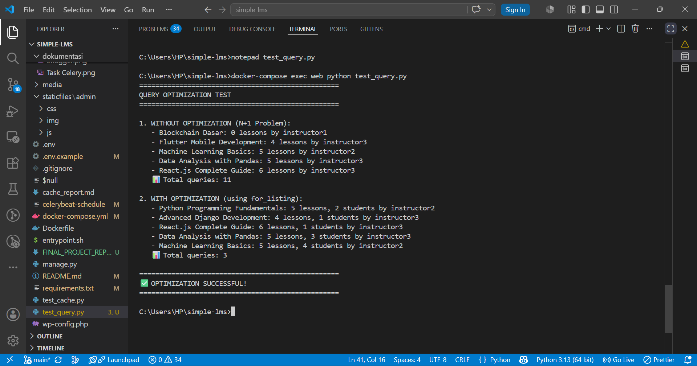

### 2. Activity Logging ke MongoDB (15 poin)

**Implementasi:**

Activity logging mencatat setiap aktivitas penting di sistem ke MongoDB. Setiap kali task scheduler berjalan, sistem menyimpan log statistik course ke collection `activity_logs`.

**Lokasi Kode:**
- `core/mongodb.py` - Koneksi dan inisialisasi MongoDB
- `core/tasks.py` - Pencatatan log dari Celery tasks`

**Data yang Dicatat:**
- Task name (`update_course_statistics`)
- Message (`Statistics Updated`)
- Statistik setiap course (id, title, enrollments, lessons)

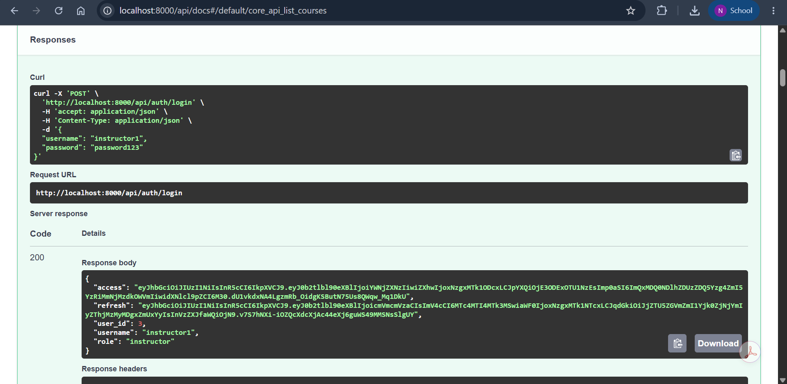
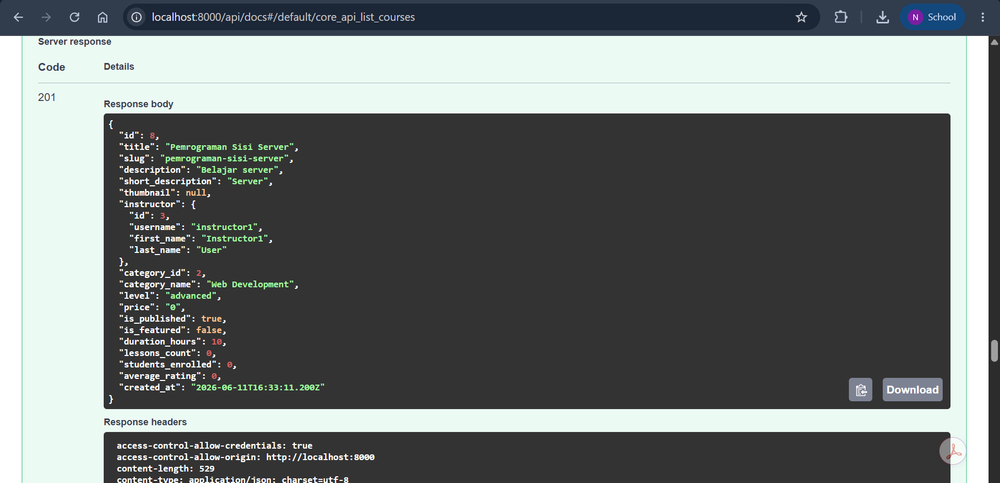
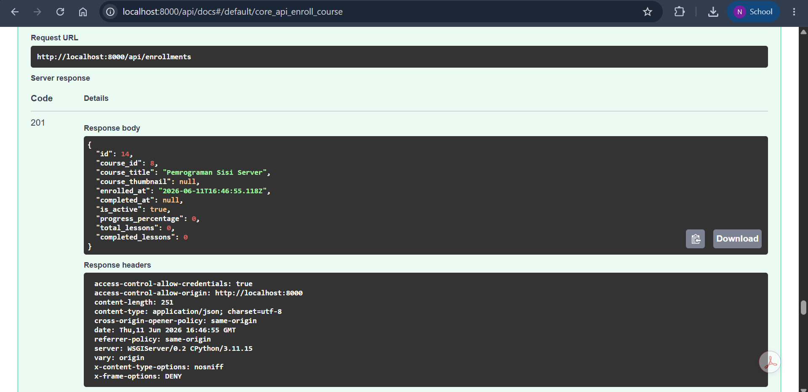

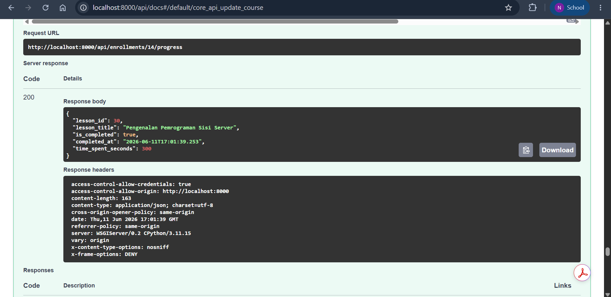
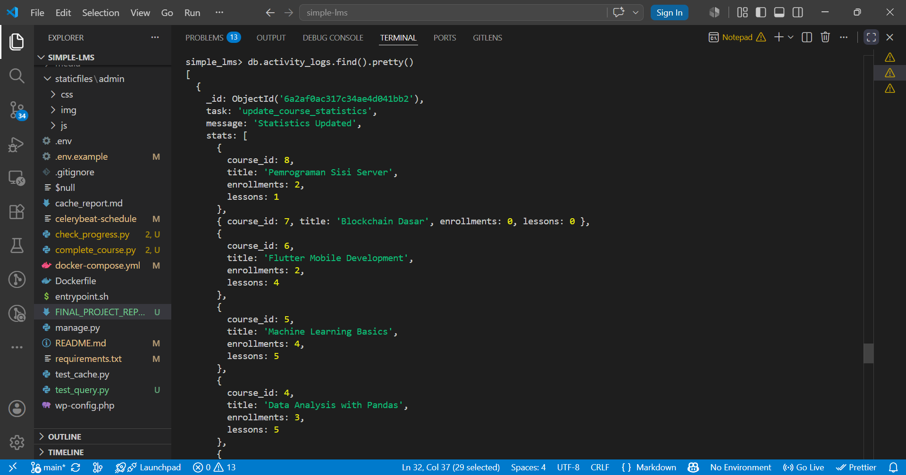

### 3. Learning Analytics Collection (15 poin)

**Implementasi:**

Learning analytics menyimpan data pembelajaran siswa ke MongoDB. Setiap kali siswa menyelesaikan lesson, sistem mencatat detail pembelajaran ke collection `learning_analytics` untuk keperluan analitik dan pelaporan.

**Lokasi Kode:**
- `core/mongodb.py` - Koneksi dan inisialisasi MongoDB
- `core/api.py` - `mark_lesson_complete()` - Pencatatan data pembelajaran

**Data yang Dicatat:**

| Field          | Deskripsi                     |
|----------------|-------------------------------|
| `user_id`      | ID user/siswa                 |
| `username`     | Nama user                     |
| `course_id`    | ID course                     |
| `course_title` | Judul course                  |
| `lesson_id`    | ID lesson                     |
| `lesson_title` | Judul lesson                  |
| `time_spent`   | Waktu yang dihabiskan (detik) |
| `completed_at` | Waktu selesai (ISO Date)      |

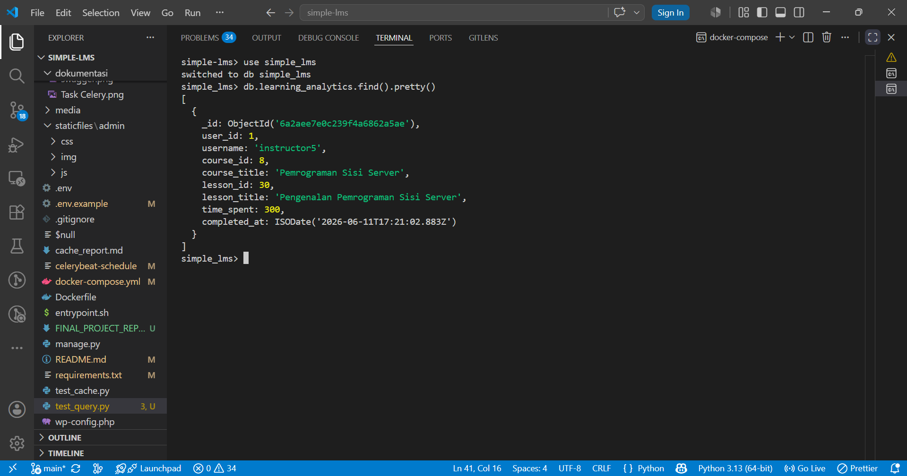

### 4. Email Notification Async (12 poin)

**Implementasi:**

Email notifikasi dikirim secara asynchronous menggunakan Celery sebagai background task. Saat student berhasil enroll ke course, sistem tidak mengirim email secara langsung (blocking) melainkan menambahkan task ke antrian Celery yang akan diproses oleh worker secara terpisah. Hal ini membuat response API tetap cepat karena proses pengiriman email tidak memblokir request.

**Lokasi Kode:**
- `core/tasks.py` - `send_enrollment_email.delay()` dipanggil di `enroll_course()`

**Alur Kerja:**
1. Student melakukan enroll ke course melalui API
2. Sistem membuat enrollment record di database
3. Sistem memanggil `send_enrollment_email.delay(username, course_title)`
4. Task masuk ke antrian RabbitMQ
5. Celery worker mengambil task dan mengirim email (simulasi)
6. Response API tetap cepat karena proses email berjalan di background

.png)

*Gambar di atas menampilkan log Celery worker saat menjalankan task `send_enrollment_email`. Terlihat task berhasil diproses dengan pesan `[EMAIL TASK] Email sent to student2 for enrolling in React.js Complete Guide`.*

Dari screenshot log Celery worker, terlihat:
- Task ID: `fdd9f802-3191-4ec9-8098-925ab7425c34`
- Task: `core.tasks.send_enrollment_email`
- Argumen: `(student2, 'React.js Complete Guide')`
- Status: **SUCCESS** (succeeded in 0.022s)
- Output: `'Email sent to student2 for enrolling in React.js Complete Guide'`

.png)

*Gambar di atas menampilkan dashboard Flower yang memonitor task Celery. Terlihat task `core.tasks.send_enrollment_email` dengan status SUCCESS.*

Dari screenshot Flower, terlihat:
- Task `core.tasks.send_enrollment_email` berhasil dijalankan
- State: **SUCCESS**
- Args: `(student2, 'React.js Complete Guide')`
- Result: `'Email sent to student2 for enrolling in React.js Complete Guide'`
- Task sebelumnya (`update_course_statistics`) juga berhasil

### 5. Generate Certificate Async (18 poin)

**Implementasi:** 

Sertifikat dibuat secara asynchronous menggunakan Celery sebagai background task. Ketika student berhasil menyelesaikan seluruh lesson dalam suatu course (progress mencapai 100%), sistem secara otomatis memicu task `generate_certificate` yang diproses oleh Celery worker di background. Proses pembuatan sertifikat tidak memblokir user sehingga pengalaman pengguna tetap responsif.

**Lokasi Kode:**
- `core/tasks.py` - `generate_certificate.delay()` dipanggil di `mark_lesson_complete()`

**Alur Kerja:**
1. Student menyelesaikan semua lesson dalam course (progress 100%)
2. Sistem mendeteksi course telah selesai (`completed_lessons == total_lessons`)
3. Sistem memanggil `generate_certificate.delay(username, course_title)`
4. Task masuk ke antrian RabbitMQ
5. Celery worker mengambil task dan membuat sertifikat (simulasi)
6. Sertifikat tercatat di MongoDB untuk dokumentasi
7. Response API tetap cepat karena proses berjalan di background

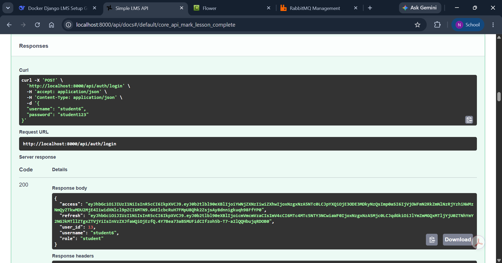
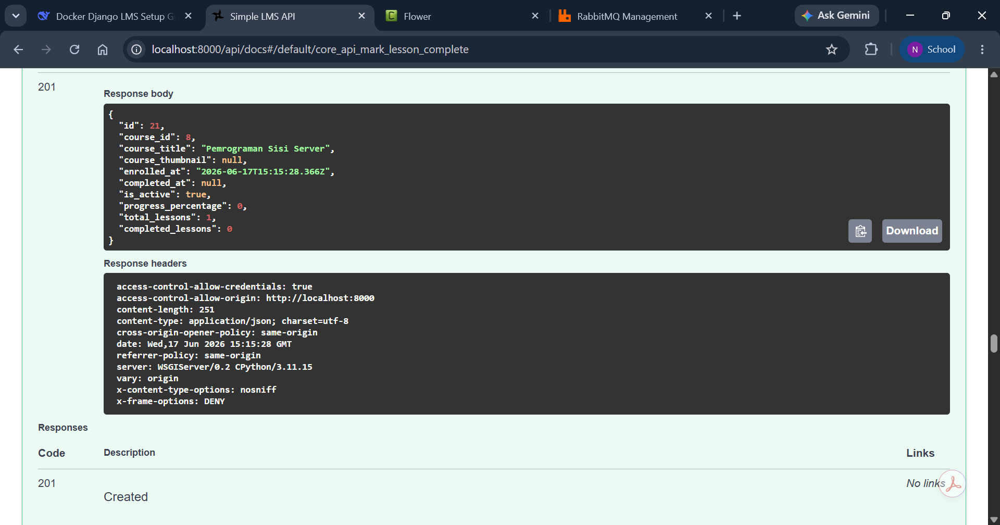
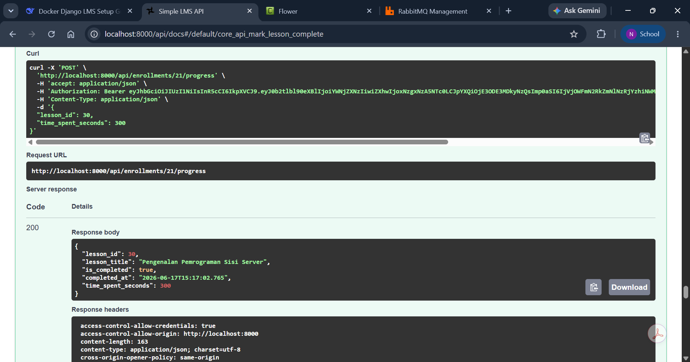
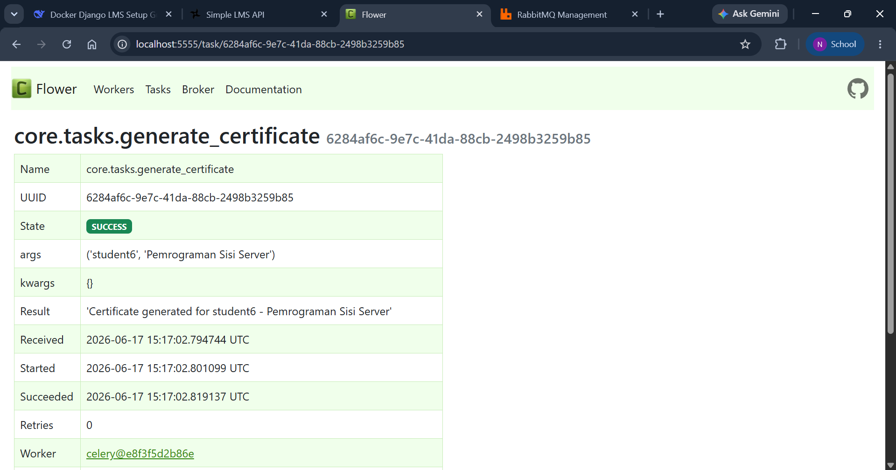
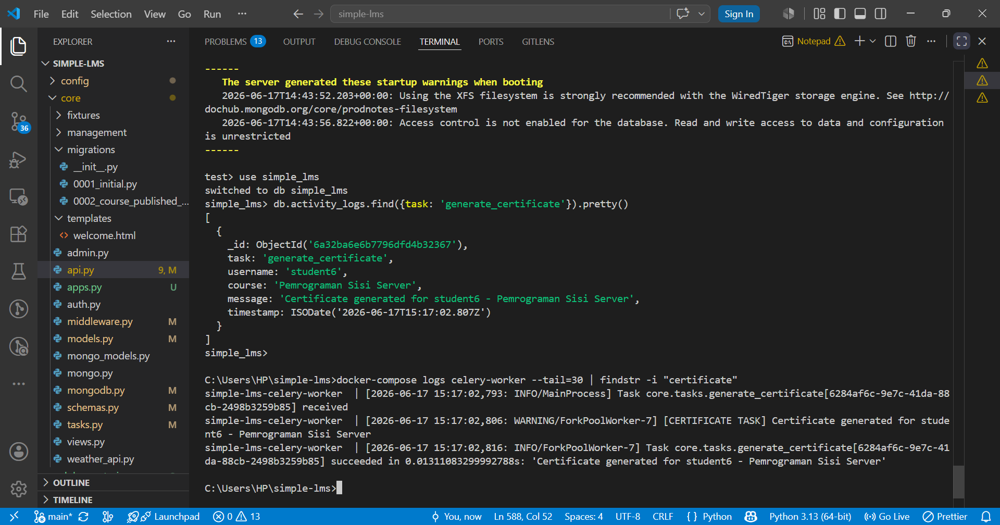

## Cara Menjalankan Project

```bash
# Clone repository
git clone https://github.com/kmilawn/PSS-Simple-LMS.git
cd PSS-Simple-LMS

# Copy environment variables
copy .env.example .env

# Build dan jalankan containers
docker-compose up -d --build

# Jalankan migration
docker-compose exec web python manage.py migrate

# Generate sample data
docker-compose exec web python manage.py generate_sample_data