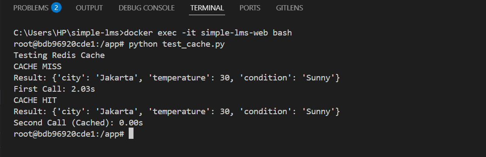
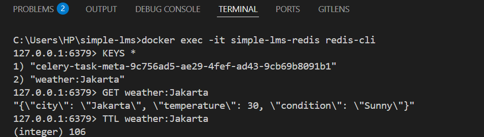

# Redis Caching Exercise

## Kenapa response time berbeda?

Karena pemanggilan pertama mengambil data dari API sehingga membutuhkan waktu sekitar 2 detik. Pemanggilan kedua mengambil data dari Redis Cache sehingga tidak perlu memanggil API lagi dan respon menjadi jauh lebih cepat.

## Apa keuntungan caching?
- Mempercepat response aplikasi
- Mengurangi beban server/API
- Menghemat bandwidth
- Meningkatkan pengalaman pengguna

## Kapan sebaiknya tidak menggunakan cache?
- Data berubah sangat cepat
- Data harus selalu real-time
- Data sensitif yang berbeda untuk setiap pengguna
- Data jarang digunakan sehingga cache tidak memberi manfaat

## 1. Hasil Testing

## 2. Redis Key dan TTL

